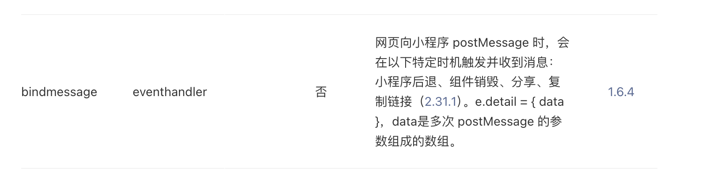
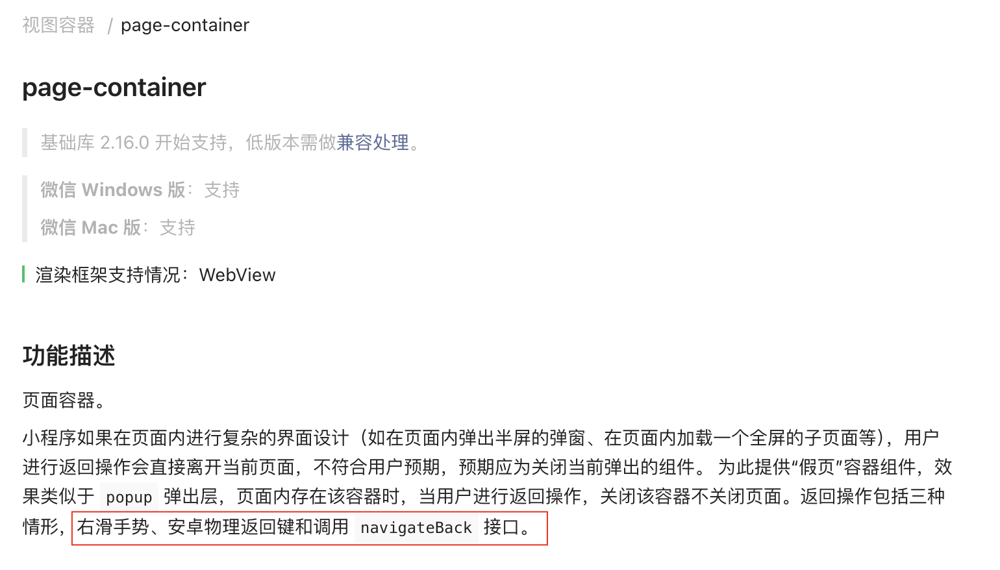
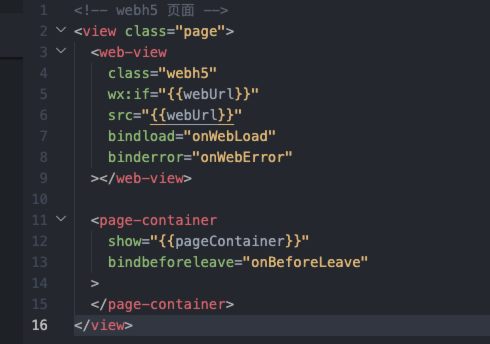
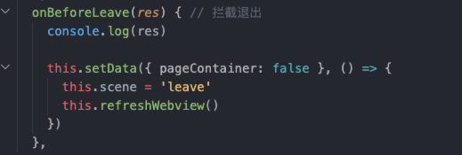
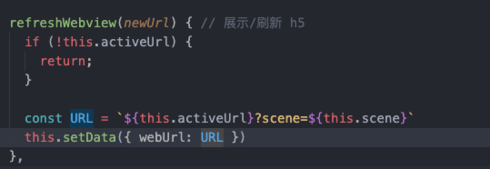
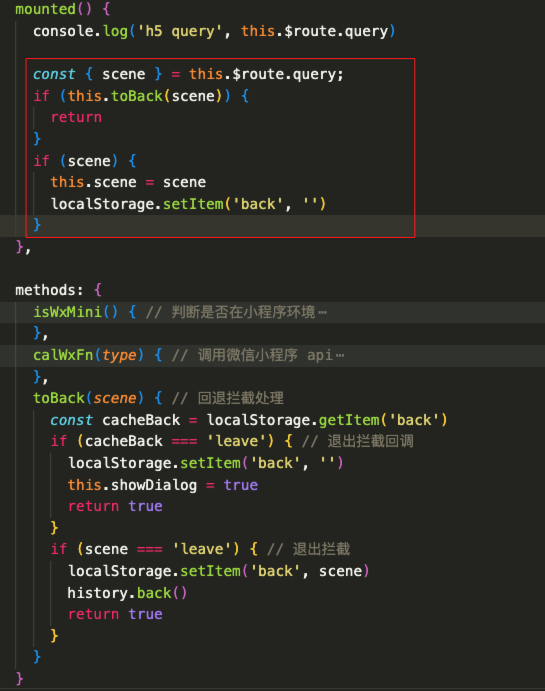

# webview 退出拦截和通信

背景：微信小程序 web-view 组件内嵌 h5 活动页

需求：h5 活动页退出时出拦截弹窗，web-view 需要和 h5 通信

## 退出拦截

### 方案探索

1. web-view `bindmessage` 属性



行不通：只在特定时机触发（小程序后退、组件销毁、分享、复制链接）。

2. `page-container` 组件



可行。

### 拦截实现

1. web-view wxml



2. web-view js



说明：用户第一次点击退出会被拦截，再次点击退出无法拦截会回退，符合要求。

## web-view 和 h5 通信

### 实现方案

web-view 通过重设 h5 url（改参数）触发 h5 的重新加载，而不刷新页面。

这种方法会增加一条 history 记录，导致用户在后退时可能会退到 webview 内的前一个页面，而不是小程序的前一个页面。

需要通过 `history.back()` 回退消除掉多加的 history 记录。

1. web-view



2. h5



### 其他方案

1. 通过重新设置 src 属性更新页面

可以通过重新设置 webview 的 src 属性来强制刷新页面。

缺点：页面会刷新，闪一下。

```html
<!-- 页面 WXML 文件 -->
<web-view id="myWebview" src="{{webviewUrl}}"></web-view>
```

```js
// 页面 JS 文件
Page({
  data: {
    webviewUrl: 'https://example.com'
  },
  onLoad() {
    // 初始加载
    this.setData({
      webviewUrl: 'https://example.com'
    });
  },
  refreshWebview() {
    this.setData({
      webviewUrl: ''
    }, () => {
      this.setData({
        webviewUrl: 'https://example.com'
      });
    });
  }
});
```

2. 使用 `wx.redirectTo` 方法

可以通过 `wx.redirectTo` 跳转到当前 webview 页面（实际上是关闭当前页面并重新打开）来间接实现 webview 页面的刷新。

这种方法会导致用户体验上的短暂闪烁，并且会增加页面加载时间。