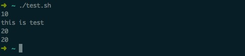
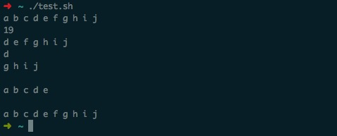
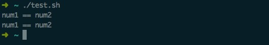
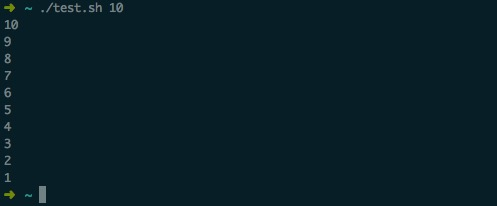
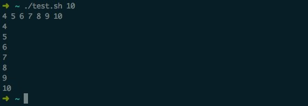
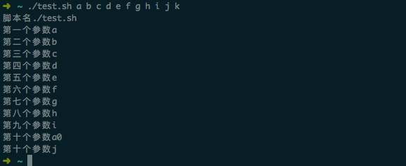

# Shell 脚本编写教程

Shell 脚本与 Windows/Dos 下的批处理相似，也就是用各类命令预先放入到一个文件中，方便一次性执行的一个程序文件，主要是方便管理员进行设置或者管理用的。但是它比 Windows 下的批处理更强大，比用其他编程程序编辑的程序效率更高，它使用了 Linux/Unix 下的命令。

更明白地来说，shell script 就像早期 dos 年代的 [.bat](https://baike.baidu.com/item/%E6%89%B9%E5%A4%84%E7%90%86/1448600?fromtitle=.bat&fromid=6476412)，最简单的功能就是将许多指令汇整写一起，让使用者很容易地就能够一个操作执行多个命令，而 shell script 更是提供了数组，循环，条件以及逻辑判断等重要功能，让使用者可以直接以 shell 来写程序，而不必使用类似 C 程序语言等传统程序编写的语法。[语法参考](https://blog.csdn.net/qq_18297675/article/details/52693464)

## 执行命令

方法一： `bash test.sh`

方法二： 给 test.sh 文件增加可执行权限

`chmod 755 test.sh`

`./test.sh`

## 语法

### 基础语法

1. `#!/bin/bash` #! 是一个约定的标记，它告诉系统这个脚本需要什么解释器来执行，即使用哪一种 Shell

2. `set -e` 确保脚本抛出遇到的错误

3. 数据类型：只有字符串和整型两种

4. 使用双引号


### 变量

shell 的变量赋值的时候不用带 `$`，而使用或者输出的时候要带 `$`。加减乘除的时候要加两层小括号。括号外面要有一个 `$`，括号里面的变量可以不用 `$`。需要注意的是，变量赋值，等号两边不能有空格，否则会被解析成命令，报错无此命令。


``` bash
# 变量
a=10
b=10
c="this is test"
d=$((a+b))

echo $a
echo $c
echo $d
echo $((a+b))
```




### 表达式

``` bash
str="a b c d e f g h i j"

echo ${str}          #源字符串
echo ${#str}         #字符串长度，包含空格
echo ${str:5}        #截取从第五个后面开始到最后的字符
echo ${str:5:2}      #截取从第五个后面开始的2个字符
echo ${str#a*f}      #从开头删除a到f的字符
echo ${str##a*}      #从开头删除a以后的字符
echo ${str%f*j}      #从结尾删除f到j的字符
echo ${str%%*j}      #从结尾删除j前面的所有字符包括j
echo ${str}
```




### 判断

`[ ]` 里面每个变量之间都要有空格

`-gt >` `-ge >= ` `-lt < ` `-le <= ` `-eq =` `-ne !=`

``` bash
# 判断 test 或 []
num1=10
num2=10

test $num1 -eq $num2 && echo "num1 == num2" || echo "num1 != num2"

[ $num1 -eq $num2 ] && echo "num1 == num2" || echo "num1 != num2"

```




### 条件语句

格式：if 条件 ; then 结果 fi ，最后面一定要有 fi 。在 shell 脚本里面，控制分支结构结束都要和开头的单词相反，例如，`if <–> fi`，`case <–> esac`。

``` bash
grades=70

if [ $grades -ge 90 ] && [ $grades -le 100 ];then
echo "Your grade is excellent."
elif [ $grades -ge 80 ] && [ $grades -le 89 ];then
echo "Your grade is good."
elif [ $grades -ge 70 ] && [ $grades -le 79 ];then
echo "Your grade is middle."
elif [ $grades -ge 60 ] && [ $grades -le 69 ];then
echo "Your grade is passing."
else
echo "Your grade is badly."
fi
```

### 循环语句

#### while 语句

while 语句是只要条件为真就执行下面语句。需要注意的是，这里的条件除了 while true 可以这样写，其它的条件都要用 test 或者 [ ] 来判断

``` bash
i=$1
while [ $i -gt 0 ]
do
echo $i
((i--))
done
```




#### until 语句

until 语句是只要条件为假就执行下列语句。

``` bash
i=$1
until [ $i -le 0 ]
do
echo $i
((i--))
done
```


#### for 语句

``` bash
a=`seq 4 10`

echo $a

for i in `seq 4 10` #seq是一个命令，顺序生成一串数字或者字符
do
   echo $i
done
```




### 函数

``` js
funcName() {
    语句
    [return 返回值]
}
```

返回值是可选的，如果没有显示 return 则默认返回最后一条语句执行的结果。

Shell 函数返回值只能是整数，一般用来表示函数执行成功与否，0表示成功，其他值表示失败。如果 return 其他数据，比如一个字符串，往往会得到错误提示：`numeric argument required`。

如果一定要让函数返回字符串，那么可以先定义一个变量，用来接收函数的计算结果，脚本在需要的时候访问这个变量来获得函数返回值。

函数参数从 `$1` 到 `$n`，`$0` 是文件名。

``` bash
# 打印数字
printNum (){
   echo $1
}

for i in `seq 2 8` #seq是一个命令，顺序生成一串数字或者字符
do
printNum $i
done
```


## 传参

采用 `$0` , `$1` , `$2` ...等方式获取脚本命令行传入的参数，`$0` 获取到的是脚本路径以及脚本名，后面按顺序获取参数，当参数超过10个时(包括10个)，需要使用 `${10}`, `${11}` ...才能获取到参数，但是一般很少会超过10个参数的情况。

``` bash
#!/bin/bash
echo "脚本名$0"
echo "第一个参数$1"
echo "第二个参数$2"
echo "第三个参数$3"
echo "第四个参数$4"
echo "第五个参数$5"
echo "第六个参数$6"
echo "第七个参数$7"
echo "第八个参数$8"
echo "第九个参数$9"
echo "第十个参数$10"
echo "第十个参数${10}"
```




