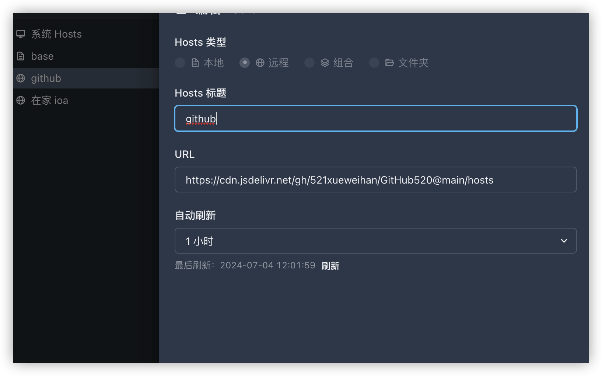
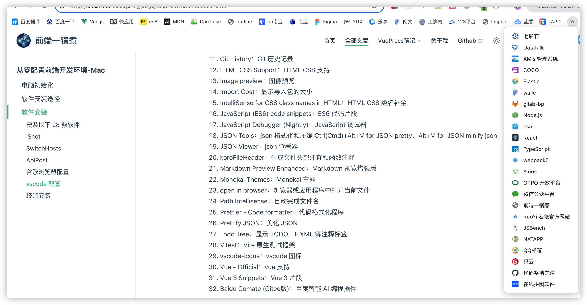
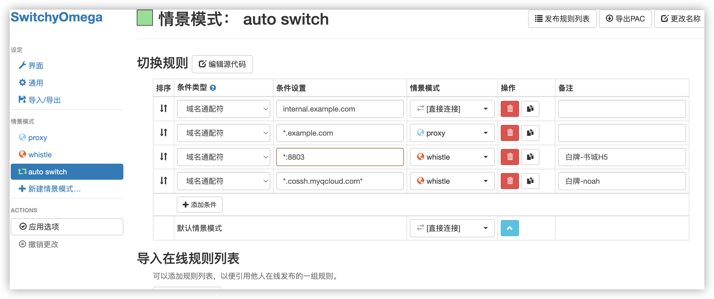
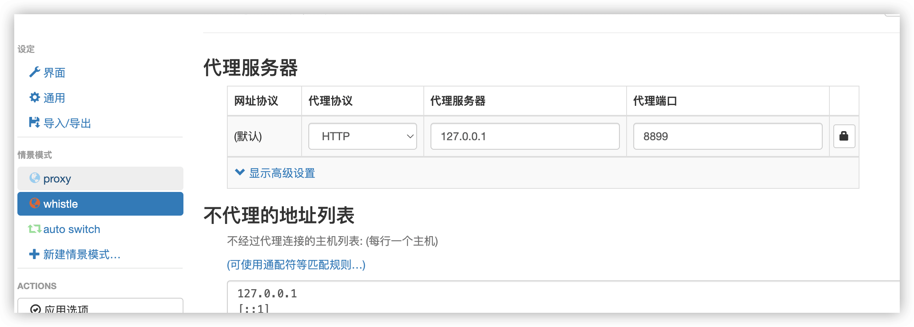
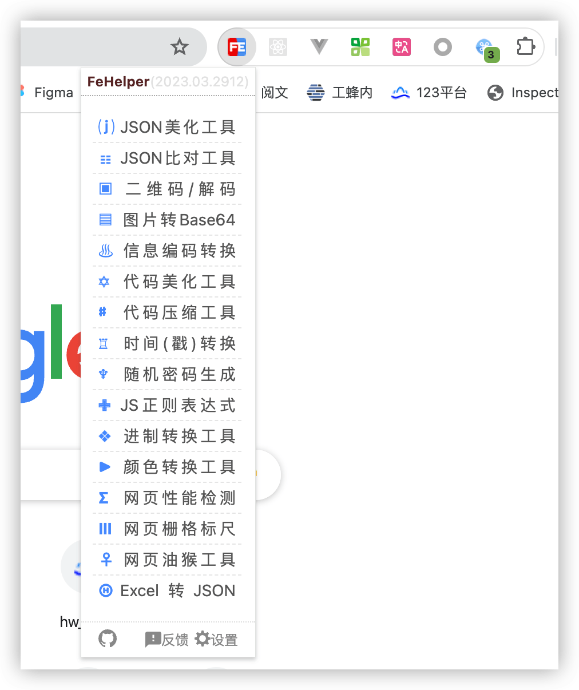
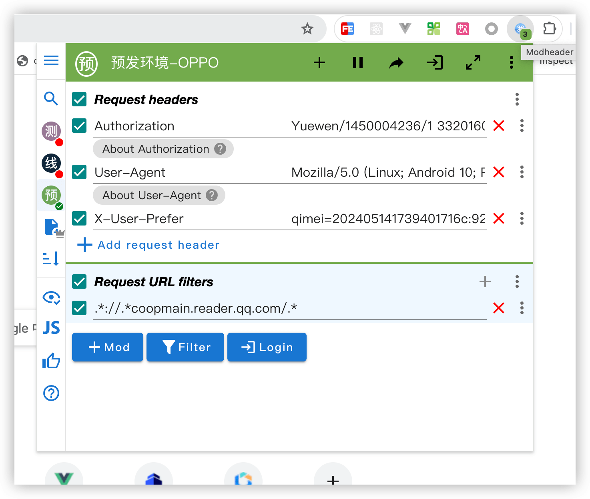

# 从零配置前端开发环境-Mac

自用 mac 电脑以来陆陆续续配置了有 6 台新电脑环境，通过迁移助手、账号同步等可以较为方便的迁移。下面记录下从零开始配置的方法。

## 电脑初始化

新电脑到手后开始一系列初始化配置，设置开机密码，登录电脑。

Mac M1芯片电脑开机密码重置方法：

- 关机状态下，先短按下开机键放开，然后-迅速-【划重点】-长-按，如果关机了就说明你不够迅速间隔时间太长了，出现选项就成功了。

- 选择 options 以后找到左上的实用工具选项，选择【终端】输入 resetpassword 按回车，解锁一个重设密码的框框，按下【取消激活Mac】。

- 然后你就可以输入新密码了，也许就是以前的密码，因为这可能是 M1 的 bug 不是你得了阿兹海默，我为质疑自己的十分钟（不断输入可能设定的密码）感到抱歉。然后按【下一步】。

## 软件安装途径

1. 应用商店下载部分常用免费软件，如果连不上就算了

2. 先粗略瞄一眼：[Mac 开发配置入门文档](https://aaaaaashu.gitbooks.io/mac-dev-setup/content/index.html)

3. **mac 软件免费下载平台**
- [MacWk](https://macwk.com.cn/soft/all/p1)
- [macw](https://www.macw.com/mac/61.html)
- [元婴 MAC 软件站](https://maczz.net/)
- [appstorrent](https://appstorrent.ru/162-transmit.html)
- [马可波罗](https://www.macbl.com/app/top/all)
- [Mac618](https://www.mac618.com/)
- [MAC 青桔](https://www.macqj.com/)
- [苹果软件盒子](https://www.macappbox.com)

4. 供参考
- [腾讯柠檬](https://lemon.qq.com/lab)
- [玩法儿](https://www.waerfa.com/category/download)
- [XMac](https://xmac.app/)
- [佛系软件](https://foxirj.com/category/macos)
- [Xclient](https://xclient.info/s/c/dev/)
- [digit77](https://www.digit77.com/categories/macapps?page=11)
- [XMAC](https://www.xmac.im/16_837.html) 苹果电脑 MAC 游戏第一站 

## 软件安装

### 安装以下 42 款软件

MacWk 平台下载 21 个：

- XMind、Sketch、Axure、Ps、Microsoft Word 套件
- Mac向日葵远程控制、Microsoft Remote Desktop-windows 远程控制
- Sourcetree、SnailSVN、SwitchHosts-修改 host、CheatSheet-查看快捷命令
- iTerm2、RDM、Navicat Premium-各类数据库查看、Charles-抓包工具
- Termius-SSH 连接工具、AlDente-电量管理工具、CleanMyMac X-电脑清理工具
- Downie-视频下载工具、Keka-解压缩工具、MonitorControl-显示器亮度调接工具

不要用百度网盘，选择天翼云盘下载速度会很快

苹果软件盒子下载 1 个：

- ScreenBrush：Mac 屏幕标记和注解工具，在演示、教学或展示时更有效地突出和注释屏幕上的内容

应用商店或者官网下载 20 个：

- [vscode](https://code.visualstudio.com/) 编程 IDE
- [微信开发者工具](https://developers.weixin.qq.com/miniprogram/dev/devtools/stable.html) 微信小程序开发
- [快应用开发工具](https://doc.quickapp.cn/ide/new.html)
- [HBuilderX](https://hx.dcloud.net.cn/Tutorial/install/macosx) uni-app 开发工具

- [draw.io](https://www.drawio.com/) 画图工具
- [ApiPost](https://www.apipost.cn/) API设计、调试、文档、自动化测试
- [Robo 3T](https://robomongo.org/) 数据库可视化工具
- [PPDuck](https://ppduck.com/) 图片保真压缩
- [iShot](https://apps.apple.com/cn/app/ishot-%E4%BC%98%E7%A7%80%E7%9A%84%E6%88%AA%E5%9B%BE%E8%B4%B4%E5%9B%BE%E5%BD%95%E5%B1%8F%E5%BD%95%E9%9F%B3ocr%E7%BF%BB%E8%AF%91%E5%8F%96%E8%89%B2%E6%A0%87%E6%B3%A8%E5%B7%A5%E5%85%B7/id1485844094?mt=12&ct=betterapps) 截图软件
- [Amphetamine](apple 应用商店) 休眠设置软件

- [谷歌浏览器](https://chrome.xznwx.cn/mac.html)
- [火狐浏览器](https://www.firefox.com.cn/)
- [Microsoft Edge](https://www.microsoft.com/en-us/edge?ep=0&form=MA13M0&es=40)

- [钉钉](https://page.dingtalk.com/wow/z/dingtalk/simple/ddhomedownload#/)
- [微信](https://weixin.qq.com/)
- [QQ](https://im.qq.com/index/)
- [企业微信](https://work.weixin.qq.com/#indexDownload)
- [腾讯会议](https://meeting.tencent.com/download?mfrom=OfficialIndex_TopBanner1_Download)
- [百度网盘](https://pan.baidu.com/download?_at_=1720063213588#pan)
- [uTools 工具管理平台](https://u.tools)

### ishot 

快捷键设置：

- 截图翻译：cmd + 1
- 截图：cmd + 2
- 取色：cmd + 2 进入截图状态然后点 h 键
- ORC：cmd + 3
- 延时全屏截图：cmd + 4
- 开始/停止录屏：cmd + 5
- 暂停/恢复录屏：cmd + 6
- 开始录音：cmd + 7

### SwitchHosts

- base
```bash
127.0.0.1 localhost
255.255.255.255	broadcasthost
::1	localhost
127.0.0.1 license.sublimehq.com ajax.googleapis.com

# Added by Docker Desktop
# To allow the same kube context to work on the host and the container:
127.0.0.1 kubernetes.docker.internal

# gitlab git.uthealth.com.cn
120.92.63.101 git.uthealth.com.cn
```

- github
```bash
  https://cdn.jsdelivr.net/gh/521xueweihan/GitHub520@main/hosts
  1小时
```



### ApiPost

api 接口管理

- 账号：1293004002@qq.com
- 密码：xxxxxxxxx

### natapp

内网穿透：natapp 分配一个专属域名/端口来访问内网

[使用文档](https://natapp.cn/article/natapp_newbie)

- 账号：17810263249
- 密码：xxxxxxxxx

### 谷歌浏览器配置

书签：从原电脑下载书签然后传给新电脑，或者账号登录同步



扩展程序：
- 草料二维码
- 沉浸式翻译
- Proxy SwitchyOmega
- Vue.js devtools
- React Developer Tools
- FeHelper(前端助手)
- ModHeader - Modify HTTP headers：修改 HTTP 请求头、响应头和重定向 URL
- EditThisCookie：cookie管理器，可以添加，删除，编辑，搜索，锁定和屏蔽cookies






## vscode 配置

可通过账号同步功能同步全部插件和配置

### 安装插件 35 个

1. Baidu Comate：百度智能 AI 编程插件
2. Apollo GraphQL：GraphQL 支持
3. Chinese (Simplified) (简体中文)
4. Code Runner：代码运行程序
5. CodeSnap：代码截图
6. common-intellisense：组件库提示插件
7. CSS Peek：标签上查看 css 样式
8. Docker：Docker 扩展，可生成、管理和部署容器化应用程序
9. EditorConfig for VS Code VS Code：查找 .editorconfig 的设置覆盖用户/工作区设置
10. es6-string-html：在模版字符串前加上一个前缀注释 `/*html*/<p>p1</p>` 以高亮 html
11. ESLint eslint：规则检查
12. filesize：显示焦点文件的大小
13. Git History：Git 历史记录
14. GitLens — Git supercharged：Git 增强
15. HTML CSS Support：HTML CSS 支持
16. Image preview：图像预览
17. Import Cost：显示导入包的大小
18. IntelliSense for CSS class names in HTML：HTML CSS 类名补全
19. JavaScript (ES6) code snippets：ES6 代码片段
20. JavaScript Debugger (Nightly)：JavaScript 调试器
21. JSON Tools：json 格式化和压缩 Ctrl(Cmd)+Alt+M for JSON pretty、Alt+M for JSON minify json
22. JSON Viewer：json 查看器
23. koroFileHeader：生成文件头部注释和函数注释
24. Markdown Preview Enhanced：Markdown 预览增强版
25. Monokai Themes：Monokai 主题
26. open in browser：浏览器或应用程序中打开当前文件
27. Prettier - Code formatter：代码格式化程序
28. Prettify JSON：美化 JSON
29. Todo Tree：显示 TODO、FIXME 等注释标签
30. Vitest：Vite 原生测试框架
31. vscode-icons：vscode 图标
32. Vue - Official：vue 支持
33. Vue 3 Snippets：Vue 3 片段
34. SVG：SVG 编辑
35. SVG Preview：SVG 预览

### 关闭的插件

1. Vetur：vue2 支持
2. Draw.io Integration：vscode Draw.io 集成
3. Office Viewer(Markdown Editor)：支持预览常见的办公文件格式
4. markdownlint：Markdown 样式检查
5. Minify：压缩 js css html
6. Dash：API 文档浏览器和代码片段管理器
7. View Node Package：直接从 Code 打开 Node 包存储库/文档
8. Sass/Less/Stylus/Pug/Jade/Typescript/Javascript Compile Hero Pro：编译 ts、tsx、scss、less、stylus、jade、pug 和 es6+。
9. Auto Rename Tag：自动重命名配对的 HTML/XML 标记，vscode 已内置
10. Path Intellisense：自动完成文件名，vscode 已内置
11. any-rule：正则大全

### 设置调整

- Auto Save - onFocusChange
- Tab Size - 2
- Cursor Style - line-thin
- Word Wrap - on 在视区宽度处换行
- Auto Indent - advanced 粘贴保留格式
- Folding Strategy - indentation 按空格缩进收起
- Guides: Highlight Active Indentation - false 控制是否突出显示编辑器中活动的缩进参考线。
- Match Brackets - never 突出显示匹配的括号
- Max Tokenization Line Length - 50000
- Sticky Scroll: Enabled - false 关闭粘性滚动
- Cursor Blinking - smooth
- Minimap: Enabled - false
- Minimap: Max Column - 40
- Files: Default Language - html 新建文件时文件格式
- Trim Trailing Whitespace - false 文件保存时去除末尾的空格
- Color Theme - Monokai
- Icon Theme - VSCode Icons
- Tree: Indent - 10
- Tree: Render Indent Guides - none
- Zoom Level - 1
- Auto Reveal - false 选中文件不自动展开
- Compact Folders - false 折叠空白文件夹
- Confirm Delete - false
- Confirm Drag And Drop - false
- Follow Symlinks - false 修复 vscode 造成 rg.exe内存占用过大的问题
- Automation Profile: Osx
- Integrated: Cwd - /Users/qianduanyiguozhu/
- Default Profile: zsh
- Page Size - 0
- Trust: Untrusted Files - open
- Auto Navigate Next Conflict: Enabled - true
- Container Padding - 1em
- "css.enabledLanguages": [ "html", "vue", "typescript"]
- Exclude Languages - markdown
- Include Languages - 全配置
- Trigger Expansion On Tab - true
- Autorefresh - false
- Validate: Scripts - false
- Gutterpreview: Image Preview Max Height - 2000
- Gutterpreview: Image Preview Max Width - 2000
- Prettier: Semi - false
- Prettier: Single Quote - true
- Save All Files Before Run - true
- Quote Style - single
- Surveys: Enabled - false
- Hide Explorer Arrows - true
- Auto Insert: Dot Value - true
- Dont Show New Version Message - true
- Telemetry Level - off
- git.enabled: false 修复 vscode 造成 git.exe 内存占用过大的问题
- git.autorefresh: false
- Code Lens - false：关闭 AI 提示图
- Render Control Characters - true
- Guides: Highlight Active Indentation - false 控制是否突出显示编辑器中活动的缩进参考线
- Unicode Highlight: Ambiguous Characters - false
- Vue › Update Imports On File Move: Enabled - false
- JavaScript › Update Imports On File Move - prompt 启用或禁用在 VS Code 中重命名或移动文件时自动更新导入路径的功能。
- eslint.validate ["javascript","javascriptreact","vue"]
- Linked Editing："控制编辑器是否启用了链接编辑。根据语言的不同，相关符号如HTML标签在编辑时会被更新。" 默认情况下为false

### 用户代码片段

```json
  // global
	"ad1": {
		"prefix": "ad1",
		"body": [
			"过一个平凡无趣的人生实在太容易了，你可以不读书，不冒险，不运动，不写作，不外出，不折腾……但是，人生最后悔的事情就是：我本可以。",
			"$1"
		],
		"description": "create a chinese"
	},
	"ad2": {
		"prefix": "ad2",
		"body": [
			"Happiness is a way station between too much and too little.",
			"$1"
		],
		"description": "create a english"
	},
```

```json
  // css
  "flex1": {
    "prefix": "flex1",
    "body": [
      "display: flex;",
      "justify-content: center;",
      "align-items: center;",
      "$1"
    ],
    "description": "flex"
  },
  "sl1": {
    "prefix": "sl1",
    "body": [
      "display: block;",
      "white-space: nowrap;",
      "text-overflow: ellipsis;",
      "overflow: hidden;",
      "$1"
    ],
    "description": "css single line ellipsis"
  },
  "bg1": {
    "prefix": "bg1",
    "body": [
      "background:${1:#fff} url() 0 0 no-repeat;"
    ],
    "description": "background img"
  }
```

```json
  // js
	"log1": {
		"prefix": "log1",
		"body": [
			"console.log($1);"
		],
		"description": "Log output to console"
	},
	"if1": {
		"prefix": "if1",
		"body": [
			"if ($1) {",
			"  $2",
			"}",
		],
		"description": "auto create a for"
	},
	"switch1": {
		"prefix": "switch1",
		"body": [
			"switch(type$1) {",
			"  case 1: {",
			"    console.log('1');",
			"    break;",
			"  }",
			"  default: {",
			"    console.log('2');",
			"  }",
			"}",
		],
		"description": "auto create a switch"
	},
	"for1": {
		"prefix": "for1",
		"body": [
			"for (let i$1 = 0, len = arr.length; i$1 < len; i$1++) {",
			"  $2",
			"}",
		],
		"description": "auto create a for"
	},
	"forEach1": {
		"prefix": "forEach1",
		"body": [
			"forEach(v => {",
			"  $1",
			"})",
		],
		"description": "auto create a forEach and function"
	},
	"fn1": {
		"prefix": "fn1",
		"body": [
			"() => {",
			"  $1",
			"}",
		],
		"description": "auto create a function"
	},
	"fn2": {
		"prefix": "fn2",
		"body": [
			"function () {",
			"  $1",
			"}",
		],
		"description": "auto create a function"
	},
	"arr1": {
		"prefix": "arr1",
		"body": [
			"let arr = [1, 2, 3, 4, 5];",
			"$1",
		],
		"description": "auto create a [1, 2, 3, 4, 5]"
	},
	"obj1": {
		"prefix": "obj1",
		"body": [
			"let obj = {",
			"  name: '前端一锅煮',",
			"  age: 20,",
			"  time: Date.now()",
			"}",
			"$1",
		],
		"description": "auto create a obj"
	},
```

```json
  // html
	"h51": {
		"prefix": "h51",
		"body": [
			"<!DOCTYPE html>",
			"<html lang=\"zh\">",
			"  <head>",
			"    <meta charset=\"utf-8\">",
			"    <meta http-equiv=\"X-UA-Compatible\" content=\"IE=edge,chrome=1\" />",
			"    <meta name=\"renderer\" content=\"webkit\" />",
			"    <meta name=\"force-rendering\" content=\"webkit\" />",
			"    <meta name=\"viewport\" content=\"width=device-width,initial-scale=1.0,maximum-scale=1,minimum-scale=1,user-scalable=no,viewport-fit=cover\" />",
			"    <title>Examples</title>",
			"    <meta name=\"description\" content=\"\">",
			"    <meta name=\"keywords\" content=\"\">",
			"    <style>",
			"      *{margin:0;padding:0;}",
			"    </style>",
			"  </head>",
			"  <body>",
			"    <div>",
			"      ",
			"    </div>",
			"    <script src=\"http://libs.baidu.com/jquery/1.11.3/jquery.min.js\"></script>",
			"    <script type=\"text/javascript\">",
			"      $1",
			"    </script>",
			"  </body>",
			"</html>"
		],
		"description": "a html file"
	}
```

## 终端安装

1. Homebrew 安装

```bash
允许所有访问：sudo spctl --master-disable

终端执行 /bin/bash -c "$(curl -fsSL https://raw.githubusercontent.com/Homebrew/install/master/install.sh)"
网络连接失败就换国内地址 /bin/zsh -c "$(curl -fsSL https://gitee.com/cunkai/HomebrewCN/raw/master/Homebrew.sh)"
查看版本 brew -v

切换源 brew 下载源提高下载速度
  brew.git:
    cd "$(brew --repo)"
    git remote set-url origin https://mirrors.ustc.edu.cn/brew.git
  homebrew-core.git:
    cd "$(brew --repo)/Library/Taps/homebrew/homebrew-core"
    git remote set-url origin https://mirrors.ustc.edu.cn/homebrew-core.git
  替换 Homebrew Bottles 源：
    cd ~
    echo 'export HOMEBREW_BOTTLE_DOMAIN=https://mirrors.ustc.edu.cn/homebrew-bottles' >> ~/.zprofile
    source ~/.zprofile
```

2. xcode-select 安装

```bash
xcode-select --install 下载安装
xcode-select -p 查看安装目录
xcode-select -v 查看版本

删除 xcode-select
sudo rm -rf $(xcode-select --print-path)
rm -rf /Library/Developer/CommandLineTools
```

3. 工具安装

git 下载：
```bash
  brew install git
  git --version
```

nginx 下载：
```bash
  brew install nginx
  nginx -v
```

4. nvm 安装

```bash
wget -qO- https://raw.githubusercontent.com/nvm-sh/nvm/v0.40.1/install.sh | bash

touch ~/.zprofile #没有要新建 zprofile

vim ~/.zprofile 输入提示的三行
  export NVM_DIR="$HOME/.nvm"
  [ -s "$NVM_DIR/nvm.sh" ] && \. "$NVM_DIR/nvm.sh"  # This loads nvm
  [ -s "$NVM_DIR/bash_completion" ] && \. "$NVM_DIR/bash_completion"  # This loads nvm bash_completion

source ~/.zprofile // 重新加载配置

nvm --version

nvm 换源：export NVM_NODEJS_ORG_MIRROR=https://npmmirror.com/mirrors/node
新电脑默认全局安装了 v16 版本的，要先卸载掉

安装 node
  nvm install v16.20.2         安装指定版本
  nvm use v16.20.2             切换 node 版本
  nvm alias default v16.20.2   设置默认版本
  npm config get registry // 查看 npm 源
  npm config set registry https://registry.npmmirror.com // 用淘宝源

安装 cnpm
  npm install -g cnpm --registry=https://registry.npmmirror.com
  cnpm config get registry // 查看 cnpm 源
  cnpm set registry https://registry.npmmirror.com // 用淘宝源

下载 pm2
  cnpm install -g pm2
	pm2 -v
```

5. zsh 安装 oh-my-zsh 插件

```bash
	zsh 安装完成之后退出当前会话重新打开一个终端窗口
	wget https://github.com/robbyrussell/oh-my-zsh/raw/master/tools/install.sh -O - | sh
```

6. zsh 插件：
```bash
	zsh-autosuggestions
		命令提示插件，当你输入命令时，会自动推测你可能需要输入的命令，按下右键可以快速采用建议
		git clone https://github.com/zsh-users/zsh-autosuggestions $ZSH_CUSTOM/plugins/zsh-autosuggestions

	zsh-syntax-highlighting
		命令语法校验插件，在输入命令的过程中，若指令不合法，则指令显示为红色，若指令合法就会显示为绿色
		git clone https://github.com/zsh-users/zsh-syntax-highlighting.git ${ZSH_CUSTOM:-~/.oh-my-zsh/custom}/plugins/zsh-syntax-highlighting

	z
		文件夹快捷跳转插件，对于曾经跳转过的目录，只需要输入最终目标文件夹名称，就可以快速跳转

	.zshrc 文件加入插件配置
		plugins=(git zsh-autosuggestions zsh-syntax-highlighting z)

	更新配置
		source ~/.zshrc
```

7. 全局变量设置

.bashrc：被非登录用户读取

.bash_profile：只能被登录用户读取，修改后执行 source ~/.bash_profile 才生效

.zprofile：mac m 芯片由 bash_profile 变成了 zprofile

.zshrc：无论登录和非登录用户都可以读取，修改环境变量，保存修改重启终端即可

Mac OS X 的终端 Terminal.app 实际上运行了『登录Shell』而不是『非登录shell』，默认调用 .zprofile 而不是 .bashrc

Mac 安装 omyzsh 后，terminal init 的时候并不会执行 ~/.zprofile、~/.bashrc 等脚本，默认启动执行脚本变为了 ～/.zshrc

为了统一管理，做一下设置：

**.zshrc 最后一行加此代码 source ~/.zprofile**

**然后所有变量都加在 .zprofilee 中**

8. `.zprofile` 变量参考：

```bash
# 保存命令：source ~/.zprofile              

# homebrew
export HOMEBREW_PIP_INDEX_URL=http://mirrors.aliyun.com/pypi/simple #ckbrew
export HOMEBREW_API_DOMAIN=https://mirrors.aliyun.com/homebrew/homebrew-bottles/api  #ckbrew
export HOMEBREW_BOTTLE_DOMAIN=https://mirrors.aliyun.com/homebrew/homebrew-bottles #ckbrew
eval $(/opt/homebrew/bin/brew shellenv) #ckbrew

# nvm path
export NVM_DIR="$HOME/.nvm"
[ -s "$NVM_DIR/nvm.sh" ] && \. "$NVM_DIR/nvm.sh"  # This loads nvm
[ -s "$NVM_DIR/bash_completion" ] && \. "$NVM_DIR/bash_completion"  # This loads nvm bash_completion

# nvm、node
export NVM_IOJS_ORG_MIRROR=https://npmmirror.com/mirrors/iojs
export NVMW_IOJS_ORG_MIRROR=https://npmmirror.com/mirrors/iojs # window
export IOJS_ORG_MIRROR=https://npmmirror.com/mirrors/iojs
export NODIST_IOJS_MIRROR=https://npmmirror.com/mirrors/iojs

export NVM_NODEJS_ORG_MIRROR=https://npmmirror.com/mirrors/node
export NVMW_NODEJS_ORG_MIRROR=https://npmmirror.com/mirrors/node # window
export NODEJS_ORG_MIRROR=https://npmmirror.com/mirrors/node
export NODIST_NODE_MIRROR=https://npmmirror.com/mirrors/node

export NVMW_NPM_MIRROR=https://npmmirror.com/mirrors/npm # window

# mongod
export PATH="/opt/homebrew/opt/mongodb-community/bin:$PATH"

# redis
export PATH="/opt/homebrew/opt/redis/bin:$PATH"

# nginx
export PATH="/opt/homebrew/opt/nginx/bin:$PATH"

# gnu-sed
export PATH="/opt/homebrew/opt/gnu-sed/libexec/gnubin:$PATH"

# go
export PATH="/opt/homebrew/opt/go/bin:$PATH"

# deno
export PATH="/Users/qianduanyiguozhu/.deno/bin:$PATH"

# python
export PATH="/opt/homebrew/opt/python/libexec/bin:$PATH"

# oracle
export LIB_ORACLE_PATH="/Users/qianduanyiguozhu/lib/instantclient_19_8"
export PATH="$LIB_ORACLE_PATH:$PATH"

# mongod 自启动、移除自启动、重启等别名
alias mongod.start='sudo launchctl load -w ~/Library/LaunchAgents/homebrew.mxcl.mongod.plist'
alias mongod.stop='launchctl unload -w ~/Library/LaunchAgents/homebrew.mxcl.mongod.plist'
alias mongod.restart='mongod.stop && mongod.start'

# redis 自启动、移除自启动、重启等别名
alias redis.start='launchctl load -w ~/Library/LaunchAgents/homebrew.mxcl.redis.plist'
alias redis.stop='launchctl unload -w ~/Library/LaunchAgents/homebrew.mxcl.redis.plist'
alias redis.restart='redis.stop && redis.start'

# nginx 自启动、移除自启动、重启等别名
alias nginx.start='launchctl load -w ~/Library/LaunchAgents/homebrew.mxcl.nginx.plist'
alias nginx.stop='launchctl unload -w ~/Library/LaunchAgents/homebrew.mxcl.nginx.plist'
alias nginx.restart='nginx.stop && nginx.start'
```