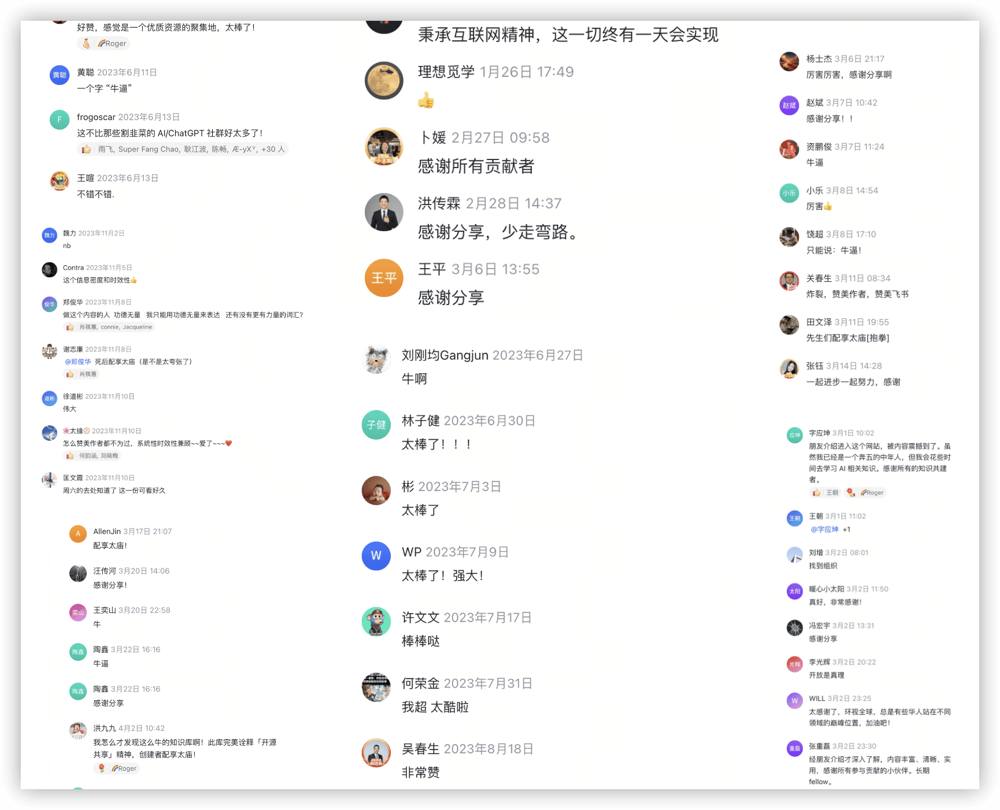

# 发现最好的 AI 工具

## AI 工具大测评（国产）

目的：AI 工具这么多，日常用哪个？找到一个好用免费的国产 AI 工具（PS：**收费的用不起，国外的用着用着就没了**）。

测评选取：小红书搜 AI 工具相关文章，统计出现次数，结合网站月访问量，综合选取前 8 个工具做测评。


八款测评目标：

- [Kimi（月之暗面）](https://kimi.moonshot.cn) https://kimi.moonshot.cn
- [天工（昆仑万维）](https://www.tiangong.cn) https://www.tiangong.cn
- [文心一言（百度）](https://yiyan.baidu.com) https://yiyan.baidu.com
- [讯飞星火（讯飞）](https://xinghuo.xfyun.cn) https://xinghuo.xfyun.cn
- [智谱清言（清华）](https://open.bigmodel.cn/trialcenter) https://open.bigmodel.cn/trialcenter
- [豆包（抖音）](https://www.doubao.com) https://www.doubao.com
- [通义千问（阿里）](https://tongyi.aliyun.com/qianwen) https://tongyi.aliyun.com/qianwen
- [腾讯混元（腾讯）](https://yuanbao.tencent.com) https://yuanbao.tencent.com

测试条件：手机号登录，免费用户，通用问答入口。

### 问题 - 推荐在线流程图工具

```text
请推荐一些在线绘制流程图工具，要求：
1. 主要给程序员使用，要简便易用
2. 需要免费并具备项目流程图绘制功能
3. 请提供每个推荐工具的简要介绍和具体访问网址
```

### 回答


分析

- Kimi：5个推荐，结果在第1位，文字排版最佳 ✅
- 天工：5个推荐，结果在第1位，有后续提问 ✅
- 文心一言：5个推荐，结果在第4位，缺少网址
- 讯飞星火：6个推荐，结果在第1位 ✅
- 智谱清言：3个推荐，结果在第1位，推荐偏少
- 豆包：5个推荐，结果在第1位，文字排版不行
- 通义千问：5个推荐，结果在第1位，其中3个推荐不行
- 腾讯混元：5个推荐，结果在第3位，名称不对

### 结果

1. 前三：**Kimi、天工、讯飞星火**

2. 经实际体验，最佳在线流程图绘制工具是：[Diagrams](https://app.diagrams.net) https://app.diagrams.net


### 问题 - vue、react diff 更新原理

```text
请详细分析 vue2 vue3 react15 react16 的 diff 更新原理
```

### 回答


### 结果

1. 前三：**Kimi、文心一言、智谱清言**

2. diff 更新原理：
- Vue 2：采用前序深度优先遍历的双端比较算法，通过 key 属性进行优化，时间复杂度为 O(n)。
- Vue 3：引入 PatchFlag 标记和最长递增子序列算法，时间复杂度为 O(nlogn)，在实际应用中减少了对 DOM 的操作次数。
- React 15：通过引入虚拟 DOM 和三层级的 Diff 策略，优化了 DOM 操作，时间复杂度为 O(n)。
- React 16：引入 Fiber 架构，允许渲染工作拆分成多个小任务，并在每一帧中执行一部分任务，从而实现更高效的更新。

### 问题 - 推荐在线编程工具

```text
请推荐一些在线编程工具，要求：
1. 主要给程序员使用使用，要简便易用
2. 需要免费
3. 请提供每个推荐工具的简要介绍和具体访问网址
```

### 回答


### 结果

1. 前三：**文心一言、Kimi、讯飞星火**

2. 经实际体验，最佳在线编程工具是：

[stackblitz](https://stackblitz.com) https://stackblitz.com


[playcode](https://playcode.io) https://playcode.io


### 问题 - 分析解释代码

```text
请详细分析并解释以下前端代码：
commitPerformanceEvent() { // 上报性能指标
  // 计算lcp
  new PerformanceObserver((entryList) => {
    for (const entry of entryList.getEntries()) {
      this.reportEventFn(entry);
    }
  }).observe({ type: 'largest-contentful-paint', buffered: true });
  // 计算fcp上报
  new PerformanceObserver((entryList) => {
    for (const entry of entryList.getEntries()) {
      if (entry.name === 'first-contentful-paint') {
        jsbridge.commitPerformanceEvent({
          cause: 'show',
          cost: entry.startTime,
        });
      }
    }
  }).observe({ type: 'paint', buffered: true });
},
```

### 回答


### 结果

1. 前三：**Kimi、文心一言、天工**

### 测评总结

四个测评问题前三汇总：

- Kimi、天工、讯飞星火
- Kimi、文心一言、智谱清言
- 文心一言、Kimi、讯飞星火
- Kimi、文心一言、天工

测评得票数：

1. Kimi 4
2. 天工 2
3. 文心一言 3
4. 讯飞星火 2
5. 智谱清言 1
6. 豆包 0
7. 通义千问 0
8. 腾讯混元 0

### 最终测评结果

前三排名：**Kimi、文心一言、天工**

### Kimi 实战


## AI 编程插件哪家强（VSCode）

AI 编程工具这么多，到底用哪个？

介绍 9 款 vscode 编程插件。

### Baidu Comate ✅

[Baidu Comate - 文心快码（百度）](https://marketplace.visualstudio.com/items?itemName=BaiduComate.comate)

- 代码补全：单行推荐、多行代码块推荐、多条推荐自由切换
- 代码注释：函数注释、行间注释
- 代码优化：代码优化、代码修复
- 单测生成
- 智能问答
- 下载量 12.8w

整体使用体验较好

### TONGYI Lingma ✅

[TONGYI Lingma - 通义灵码（阿里）](https://marketplace.visualstudio.com/items?itemName=Alibaba-Cloud.tongyi-lingma)

- 代码补全：行级、函数级实时续写
- 代码注释：函数注释、行间注释
- 根据注释生成代码
- 代码解释
- 单测生成
- 智能问答
- 下载量 47w

使用体验略低于文心快码

### CodeGeeX

[CodeGeeX - 智谱清言](https://marketplace.visualstudio.com/items?itemName=aminer.codegeex)

- 代码补全
- 代码注释
- 代码优化：代码审查
- 根据注释生成代码
- 单测生成
- 智能问答 预测候选问题
- 下载量 54.2w

代码补全太过灵敏，不推荐

### MarsCode

[MarsCode - 豆包（字节）](https://marketplace.visualstudio.com/items?itemName=MarsCode.marscode-extension)

- 代码补全：提供单行或多行的代码推荐，并支持通过注释生成代码片段
- 代码注释：函数注释、行间注释
- 代码优化：智能修复
- 代码解释
- 单测生成
- 智能问答
- 下载量 2.3w

下载量低，代码补全不够好用，常规功能用起来不够方便，不推荐

### SkyCode

[SkyCode - 天工智码（昆仑万维）](https://marketplace.visualstudio.com/items?itemName=singularity-ai.skycode)

- 代码补全
- 根据注释生成代码
- 智能问答
- 下载量 0.2w

功能不全，不推荐

### iFlyCode

[iFlyCode - 科大讯飞](https://marketplace.visualstudio.com/items?itemName=AnhuiZhuojianTechnology.iFlyCode)

- 代码补全：单行代码补全、代码块补全、函数补全
- 智能问答
- 下载量 2.7w

功能不全，不推荐

### Tencent Cloud AI Code Assistant

[Tencent Cloud AI Code Assistant - 腾讯云 AI 代码助手](https://marketplace.visualstudio.com/items?itemName=Tencent-Cloud.coding-copilot)

- 代码补全：代码块补全、函数补全
- 代码注释
- 代码优化：代码审查
- 根据注释生成代码
- 智能问答
- 下载量 1.2w

无单测生成，下载量低，代码补全不好用，不推荐

### Codeium

[Codeium](https://marketplace.visualstudio.com/items?itemName=Codeium.codeium)

- 代码补全
- 代码解释
- 代码优化：代码优化、代码修复
- 根据注释生成代码
- 代码翻译
- 智能问答
- 下载量 123.4w

国外插件，无单测生成，代码补全不好用，不推荐

### Bito AI Code Assistant

[ChatGPT GPT-4 - Bito AI Code Assistant](https://marketplace.visualstudio.com/items?itemName=Bito.Bito)

- 代码补全
- 代码注释
- 代码优化：代码优化、代码修复
- 代码解释
- 单测生成
- 智能问答
- 下载量 59.6w

国外插件，有限免费，不推荐

## AI 工具大全（精选）

AI 工具、导航网站、学习资料太多了，从里面精选出最好用的，给大家分享一下。


### 最全的 AI 工具集

[AI工具集](https://ai-bot.cn) https://ai-bot.cn

AI 工具分类细，每日 AI 快讯热闻，月访问量 110 万。


### 最大的 AI 导航网站

[Toolify](https://www.toolify.ai/zh) https://www.toolify.ai/zh

最大的 AI 导航网站，有各种分类、榜单，月访问量 420 万。


### 最牛的 AI 知识库（五星推荐）

[通往 AGI 之路](https://waytoagi.feishu.cn/wiki/Hxrbwx4XridGlWkp0ZtcqKVanBn) https://waytoagi.feishu.cn/wiki/Hxrbwx4XridGlWkp0ZtcqKVanBn

飞书文档，各类教程合集，非常详细，有非常多有意思的东西。

信息新、全、质量高，评价很高。

AI 学习主要看这个就够了，**五星级超级推荐**。




### 怎么用 AI 搞副业赚钱？

1. [AIbase 知识库](https://qqi2gjmnk4.feishu.cn/wiki/Do1kwF4t7in9XDkcpwIc4idHn9e) https://qqi2gjmnk4.feishu.cn/wiki/Do1kwF4t7in9XDkcpwIc4idHn9e


2. [一起用AI](https://17yongai.com) https://17yongai.com

[github 地址](https://github.com/bleedline/aimoneyhunter) https://github.com/bleedline/aimoneyhunter


## 总结

### 日常 AI 搜索工具：[Kimi](https://kimi.moonshot.cn) [文心一言](https://yiyan.baidu.com)

### 日常 AI 编程工具：[Baidu Comate](https://marketplace.visualstudio.com/items?itemName=BaiduComate.comate)

### AI 工具集：[AI工具集](https://ai-bot.cn)

### AI 导航网站：[Toolify](https://www.toolify.ai/zh)

### AI 知识库：[通往 AGI 之路](https://waytoagi.feishu.cn/wiki/Hxrbwx4XridGlWkp0ZtcqKVanBn)

### AI 赚钱：[一起用AI](https://17yongai.com)

链接：

```text
Kimi：https://kimi.moonshot.cn
文心一言：https://yiyan.baidu.com
Baidu Comate：https://marketplace.visualstudio.com/items?itemName=BaiduComate.comate
AI工具集：https://ai-bot.cn
Toolify：https://www.toolify.ai/zh
通往 AGI 之路：https://waytoagi.feishu.cn/wiki/Hxrbwx4XridGlWkp0ZtcqKVanBn
一起用AI：https://17yongai.com
```